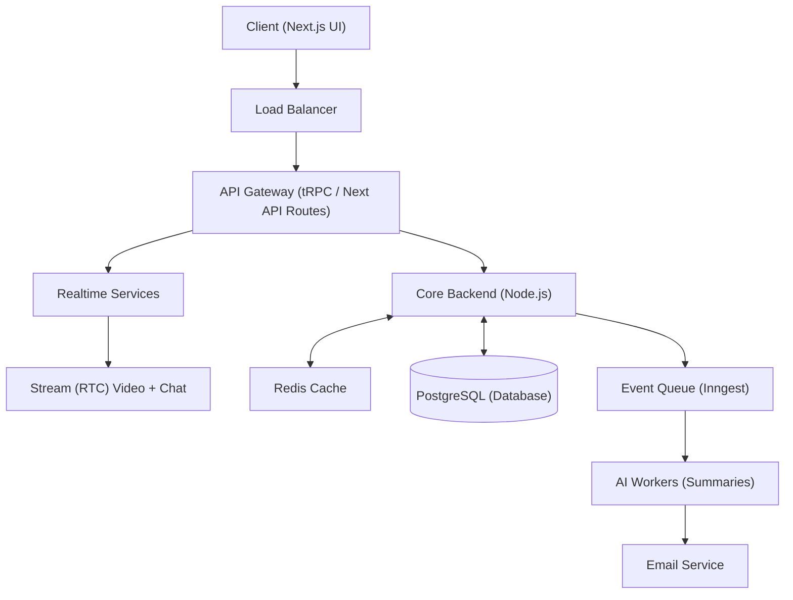

# Meet-AI 🎙️🤖

Meet-AI is a next-generation, real-time AI-powered meeting transcription and summarization platform. It enables seamless video conferencing, automated high-fidelity transcriptions, AI-driven meeting enrichment, and automated summary emails delivered directly to users. 

Equipped with robust queueing, caching layers, and subscription monetization, Meet-AI is engineered for production-ready performance.

---

## 🚀 Key Features

* **Real-time Video & Chat**: Powered by **Stream Video & Chat SDK** for high-performance audio/video calls, screen sharing, and real-time messaging.
* **AI-Powered Meeting Insights**: Leverages **OpenAI & Gemini** via **Inngest Agent Kit** to process raw transcripts, extract key action items, and generate comprehensive meeting summaries.
* **Event-Driven Workflow Queue**: Handles asynchronous post-meeting workloads (transcript fetching, AI analysis, email delivery) using **Inngest** for guaranteed background processing.
* **Global Subscription Billing**: Integrated with **Polar.sh** to monetize the application, handle global tax compliance, manage recurring subscriptions, and enforce paywalls.
* **Fast Caching Layer**: Utilizes **Redis** (via `ioredis`) as an in-memory cache to store meeting records and optimize response times, avoiding unnecessary database hits.
* **End-to-End Type Safety**: Driven by a **tRPC** routing layer connecting the Next.js App Router backend with the client UI seamlessly.
* **Seamless Authentication**: Powered by **Better-Auth** with plugins configured for Polar.sh, supporting Google, GitHub, and email/password providers.
* **Modern Stack UI**: Designed with **TailwindCSS**, **Framer Motion**, **Radix UI**, **Lucide Icons**, and responsive layouts.

---

## 🛠️ Technical Stack

* **Framework**: Next.js (App Router)
* **API Layer**: tRPC
* **Database**: PostgreSQL (Neon Database serverless) + Drizzle ORM
* **Cache**: Redis (`ioredis`)
* **Queue / Workflows**: Inngest
* **Authentication**: Better-Auth
* **Billing / Subscriptions**: Polar.sh
* **Video/Chat Service**: Stream.io SDK
* **AI Services**: OpenAI / Inngest Agent Kit

---

## 📐 System Architecture

The application implements a decoupled, event-driven architecture designed to manage compute-heavy AI workflows smoothly without blocking the main thread:



1. **Meeting Interface**: The client participates in a call powered by the Stream SDK. When a meeting completes, a webhook triggers.
2. **Database & Cache**: Core records are saved in **PostgreSQL**. **Redis** caches active meeting details (`meetingCache`) to speed up subsequent reads.
3. **Inngest Queue**: Post-meeting tasks are pushed to Inngest to run asynchronously.
4. **AI Processing**: Workers download the transcript, run AI summarization models, write the final summary back to Postgres/Redis, and mark the status as `completed`.
5. **Email Dispatch**: A downstream Inngest function triggers the `emailService` to send a summary email to the host.

---

## ⚙️ Installation & Setup

### Prerequisites

Make sure you have the following installed:
* **Node.js** (v18 or higher)
* **PostgreSQL** (Neon or local instance)
* **Redis** (Local instance or Upstash)
* **Inngest Dev Server** (locally or via CLI)

### Environment Variables

Create a `.env` file in the root directory and add the following keys:

```env
# Database
DATABASE_URL=postgresql://...

# Redis
REDIS_URL=redis://127.0.0.1:6379

# Better Auth
BETTER_AUTH_SECRET=your_better_auth_secret
BETTER_AUTH_URL=http://localhost:3000

# Auth Providers
GITHUB_CLIENT_ID=your_github_client_id
GITHUB_CLIENT_SECRET=your_github_client_secret
GOOGLE_CLIENT_ID=your_google_client_id
GOOGLE_CLIENT_SECRET=your_google_client_secret

# Stream.io (Video + Chat)
NEXT_PUBLIC_STREAM_API_KEY=your_stream_api_key
STREAM_API_SECRET=your_stream_api_secret

# Polar (Billing)
POLAR_ACCESS_TOKEN=polar_sdt_...   # Sandbox token for local testing
NEXT_PUBLIC_POLAR_ORGANIZATION_ID=your_polar_org_id

# OpenAI (AI Summaries)
OPENAI_API_KEY=your_openai_api_key

# Inngest
INNGEST_EVENT_KEY=your_inngest_event_key
INNGEST_SIGNING_KEY=your_inngest_signing_key
```

### Steps to Run

1. **Clone and Install Dependencies**:
   ```bash
   git clone <repository-url>
   cd Meet-AI
   npm install
   ```

2. **Setup and Migrate the Database**:
   ```bash
   npm run db:push
   ```

3. **Start the Development Server**:
   ```bash
   npm run dev
   ```

4. **Start the Inngest Dev Server (for event-driven workflow testing)**:
   ```bash
   npx inngest-cli@latest dev
   ```

5. **Start Webhook Tunnel (Optional - for Polar/Stream webhook testing)**:
   ```bash
   npm run dev:webhook
   ```

---

## 🔒 Access & Premium Quotas
Meet-AI utilizes custom TRPC middleware (`premiumProcedure`) linked to **Polar.sh** to manage quotas:
* **Free Tier**: Limited to a maximum number of free meetings (`MAX_FREE_MEETINGS`).
* **Premium Tier**: Unlimited meetings, advanced summaries, and immediate processing. Active subscription checking is handled entirely in memory and cached dynamically.

---

## 📧 Contact & Support
* **Email**: mir.saif.ali2004@gmail.com
* **Project**: [Meet-AI GitHub](https://github.com/mir.saif.ali2004/Meet-AI)